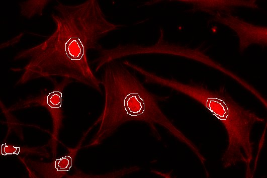

# Cytoplasmic/nuclear YAP ratio quantification

The cytoplasm of connected cells is impossible to accurately assign to each individual nucleus. This script measures 
the fluorescence intensity inside the nucleus of individual cells in a first step, and in a second, the cytoplasmic
intensity in an area (of approximately equal size to the nucleus) sourrounding the nucleus.

